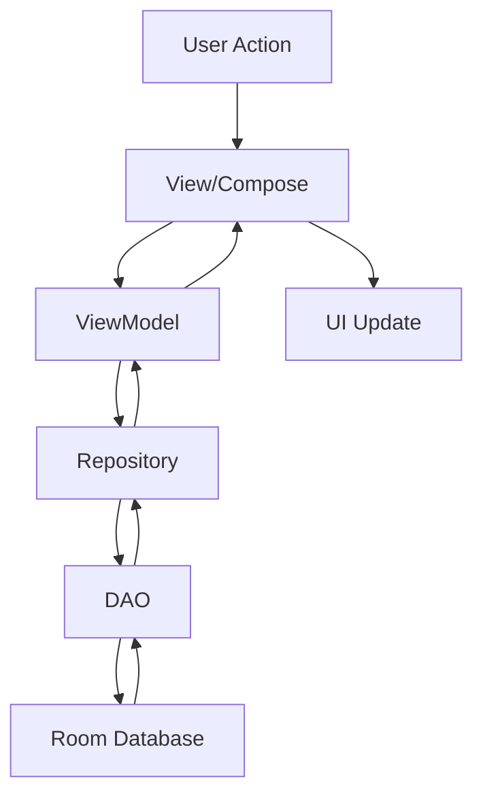

## Overview

MiTensión follows the **MVVM (Model-View-ViewModel)** architecture pattern, which provides clear separation of concerns and makes the codebase maintainable, testable, and scalable.

<CardGroup cols={3}>
  <Card title="Model" icon="database">
    Data layer with Room database, entities, DAOs, and repositories
  </Card>
  <Card title="View" icon="mobile">
    UI layer built with Jetpack Compose components
  </Card>
  <Card title="ViewModel" icon="circle-nodes">
    Business logic that connects Model and View using Kotlin Flow
  </Card>
</CardGroup>

## Architecture Layers

<Steps>
  <Step title="Data Layer (Model)">
    The data layer manages the app's data sources and business entities.
    
    **Components:**
    - `AppDatabase` - Room database singleton
    - `Medicion` - Entity representing blood pressure measurements
    - `MedicionDao` - Data Access Object for database queries
    - `MedicionRepository` - Abstraction layer between data sources and ViewModels
    
    ```kotlin
    @Database(entities = [Medicion::class], version = 1, exportSchema = false)
    abstract class AppDatabase : RoomDatabase() {
        abstract fun medicionDao(): MedicionDao
        
        companion object {
            @Volatile
            private var INSTANCE: AppDatabase? = null
            
            fun getDatabase(context: Context): AppDatabase {
                return INSTANCE ?: synchronized(this) {
                    val instance = Room.databaseBuilder(
                        context.applicationContext,
                        AppDatabase::class.java,
                        "mitension_database"
                    ).build()
                    INSTANCE = instance
                    instance
                }
            }
        }
    }
    ```
    
    <Note>
      The database uses the singleton pattern to ensure only one instance exists throughout the app lifecycle.
    </Note>
  </Step>
  
  <Step title="Repository Pattern">
    The repository acts as a single source of truth and abstracts data sources from the ViewModel.
    
    ```kotlin
    class MedicionRepository(private val medicionDao: MedicionDao) {
        
        suspend fun insertarMedicion(medicion: Medicion) {
            medicionDao.insertar(medicion)
        }
        
        suspend fun contarMedicionesEnRango(inicio: Long, fin: Long): Int {
            return medicionDao.contarMedicionesEnRango(inicio, fin)
        }
        
        fun obtenerMedicionesEnRango(inicio: Long, fin: Long): Flow<List<Medicion>> {
            return medicionDao.obtenerMedicionesPorDia(inicio, fin)
        }
        
        fun obtenerResumenMensual(inicioDelMes: Long, finDelMes: Long): Flow<List<ResumenDiario>> {
            return medicionDao.obtenerResumenMensual(inicioDelMes, finDelMes)
        }
    }
    ```
    
    **Benefits:**
    - Decouples data sources from business logic
    - Makes unit testing easier
    - Provides a clean API for ViewModels
    - Allows for future data source changes without affecting ViewModels
  </Step>
  
  <Step title="ViewModel Layer">
    ViewModels hold UI state and handle business logic. They survive configuration changes (like screen rotations).
    
    ```kotlin
    data class MedicionUiState(
        val sistolica: String = "",
        val diastolica: String = "",
        val periodo: PeriodoDelDia = obtenerPeriodoActual(),
        val numeroMedicion: Int = 1
    )
    
    class MedicionViewModel(private val repository: MedicionRepository) : ViewModel() {
        
        private val _uiState = mutableStateOf(MedicionUiState())
        val uiState: State<MedicionUiState> = _uiState
        
        private val _evento = MutableSharedFlow<UiEvento>()
        val evento = _evento.asSharedFlow()
        
        fun guardarMedicion(mensajeErrorCampos: String, 
                           mensajeErrorPeriodoLleno: String, 
                           mensajeExito: String) {
            viewModelScope.launch {
                // Validation and business logic
                val nuevaMedicion = Medicion(
                    sistolica = _uiState.value.sistolica.toInt(),
                    diastolica = _uiState.value.diastolica.toInt()
                )
                repository.insertarMedicion(nuevaMedicion)
                _evento.emit(UiEvento.GuardadoConExito(mensajeExito))
            }
        }
    }
    ```
    
    <Note>
      ViewModels use `viewModelScope` for coroutine operations, which automatically cancels when the ViewModel is cleared.
    </Note>
  </Step>
  
  <Step title="View Layer (Jetpack Compose)">
    The UI is built with declarative Jetpack Compose components that react to state changes.
    
    ```kotlin
    @Composable
    fun MedicionScreen(onNavigateToCalendario: () -> Unit) {
        val context = LocalContext.current
        val medicionDao = remember { AppDatabase.getDatabase(context).medicionDao() }
        val repository = remember { MedicionRepository(medicionDao) }
        val factory = remember { MedicionViewModelFactory(repository, errorViewModel) }
        val viewModel: MedicionViewModel = viewModel(factory = factory)
        
        val uiState by viewModel.uiState
        
        // UI reacts to state changes
        TensionDisplay(
            label = stringResource(id = R.string.tension_alta_label),
            valor = uiState.sistolica,
            onClick = { /* Show dialog */ }
        )
    }
    ```
    
    **Key Principles:**
    - UI is a function of state
    - Unidirectional data flow
    - State hoisting for reusable components
  </Step>
</Steps>

## Data Flow

The data flows through the architecture in a unidirectional manner:



<Tabs>
  <Tab title="User Input Flow">
    1. User enters blood pressure values in `MedicionScreen`
    2. View calls `viewModel.onSistolicaChanged()` or `viewModel.onDiastolicaChanged()`
    3. ViewModel updates `MedicionUiState`
    4. View recomposes with new state
    5. User clicks "Guardar" button
    6. View calls `viewModel.guardarMedicion()`
    7. ViewModel validates input and calls `repository.insertarMedicion()`
    8. Repository calls `medicionDao.insertar()`
    9. Room persists data to SQLite database
    10. ViewModel emits success event via `SharedFlow`
    11. View collects event and shows Toast message
  </Tab>
  
  <Tab title="Data Retrieval Flow">
    1. ViewModel calls `repository.obtenerMedicionesEnRango()`
    2. Repository returns `Flow<List<Medicion>>` from DAO
    3. ViewModel exposes Flow to View
    4. View collects Flow using `collectAsState()`
    5. UI automatically updates when database changes
    6. Room notifies observers via Flow when data changes
  </Tab>
</Tabs>

## Dependency Injection

MiTensión uses **manual dependency injection** without a DI framework:

```kotlin
// In MedicionScreen.kt
val medicionDao = remember { AppDatabase.getDatabase(context).medicionDao() }
val repository = remember { MedicionRepository(medicionDao) }
val factory = remember { MedicionViewModelFactory(repository, errorViewModel) }
val viewModel: MedicionViewModel = viewModel(factory = factory)
```

**Benefits:**
- No additional dependencies required
- Simple and easy to understand
- Full control over object creation
- Good for small to medium projects

<Note>
  For larger projects, consider using Hilt or Koin for automated dependency injection.
</Note>

## State Management

### UI State

MiTensión uses `State<T>` and `MutableState<T>` for UI state management:

```kotlin
private val _uiState = mutableStateOf(MedicionUiState())
val uiState: State<MedicionUiState> = _uiState
```

**Pattern:** Expose immutable state to View, keep mutable state private in ViewModel.

### Events

One-time events (like showing Toast messages) use `SharedFlow`:

```kotlin
private val _evento = MutableSharedFlow<UiEvento>()
val evento = _evento.asSharedFlow()

sealed class UiEvento {
    data class MostrarMensaje(val mensaje: String) : UiEvento()
    data class GuardadoConExito(val mensaje: String) : UiEvento()
}
```

### Database Observations

Room queries return `Flow<T>` for reactive data:

```kotlin
@Query("SELECT * FROM Medicion WHERE timestamp >= :inicioDelDia...")
fun obtenerMedicionesPorDia(inicioDelDia: Long, finDelDia: Long): Flow<List<Medicion>>
```

## Threading Model

MiTensión uses Kotlin coroutines for asynchronous operations:

<CardGroup cols={2}>
  <Card title="Main Thread" icon="circle-check">
    - UI rendering
    - State updates
    - User interactions
  </Card>
  <Card title="Background Threads" icon="database">
    - Database operations (Room)
    - Suspend functions
    - Repository calls
  </Card>
</CardGroup>

```kotlin
fun guardarMedicion(...) {
    viewModelScope.launch { // Runs on Main dispatcher
        // Room automatically switches to background thread
        repository.insertarMedicion(nuevaMedicion)
        // Back to Main thread for UI updates
        _evento.emit(UiEvento.GuardadoConExito(mensajeExito))
    }
}
```

<Note>
  Room automatically handles threading - you don't need to specify `Dispatchers.IO` for database operations.
</Note>

## Testing Strategy

### Unit Testing ViewModels

```kotlin
class MedicionViewModelTest {
    @Test
    fun `saving valid measurement updates state correctly`() {
        val mockRepository = mockk<MedicionRepository>()
        val viewModel = MedicionViewModel(mockRepository)
        
        viewModel.onSistolicaChanged("120")
        viewModel.onDiastolicaChanged("80")
        viewModel.guardarMedicion(...)
        
        coVerify { mockRepository.insertarMedicion(any()) }
    }
}
```

### Repository Testing

```kotlin
class MedicionRepositoryTest {
    @Test
    fun `repository delegates to DAO correctly`() = runTest {
        val mockDao = mockk<MedicionDao>()
        val repository = MedicionRepository(mockDao)
        
        repository.insertarMedicion(medicion)
        
        coVerify { mockDao.insertar(medicion) }
    }
}
```

## Best Practices

<CardGroup cols={2}>
  <Card title="ViewModel" icon="circle-check">
    - Keep business logic in ViewModel
    - Use `viewModelScope` for coroutines
    - Expose immutable state to View
    - Never pass Context to ViewModel
  </Card>
  <Card title="Repository" icon="database">
    - Single source of truth
    - Abstract data sources
    - Use suspend functions for one-shot operations
    - Return Flow for observable data
  </Card>
  <Card title="View/Compose" icon="mobile">
    - Keep UI components stateless when possible
    - Hoist state to appropriate level
    - Use `remember` for expensive operations
    - Collect flows safely
  </Card>
  <Card title="Data Layer" icon="table">
    - Use Room for local persistence
    - Define clear entity relationships
    - Write efficient queries
    - Use DAOs for database access
  </Card>
</CardGroup>

## Related Documentation

<CardGroup cols={2}>
  <Card title="Data Model" icon="table" href="/development/data-model">
    Explore the Room database schema and entities
  </Card>
  <Card title="UI Components" icon="palette" href="/development/ui-components">
    Learn about Jetpack Compose components
  </Card>
</CardGroup>